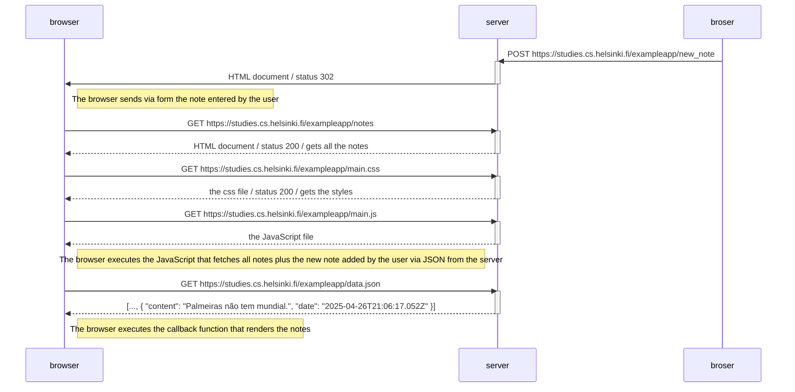

```mermaid
sequenceDiagram
  participant browser
  participant server

  broser ->>server: POST https://studies.cs.helsinki.fi/exampleapp/new_note
  activate server
  server ->> browser: HTML document / status 302
  deactivate server

  Note right of browser: The browser sends via form the note entered by the user

  browser->>server: GET https://studies.cs.helsinki.fi/exampleapp/notes
  activate server
  server-->>browser: HTML document / status 200 / gets all the notes
  deactivate server

  browser->>server: GET https://studies.cs.helsinki.fi/exampleapp/main.css
  activate server
  server-->>browser: the css file / status 200 / gets the styles
  deactivate server

  browser->>server: GET https://studies.cs.helsinki.fi/exampleapp/main.js
  activate server
  server-->>browser: the JavaScript file
  deactivate server

  Note right of browser: The browser executes the JavaScript that fetches all notes plus the new note added by the user via JSON from the server

  browser->>server: GET https://studies.cs.helsinki.fi/exampleapp/data.json
  activate server
  server-->>browser: [..., { "content": "Palmeiras não tem mundial.", "date": "2025-04-26T21:06:17.052Z" }]
  deactivate server

  Note right of browser: The browser executes the callback function that renders the notes

```
