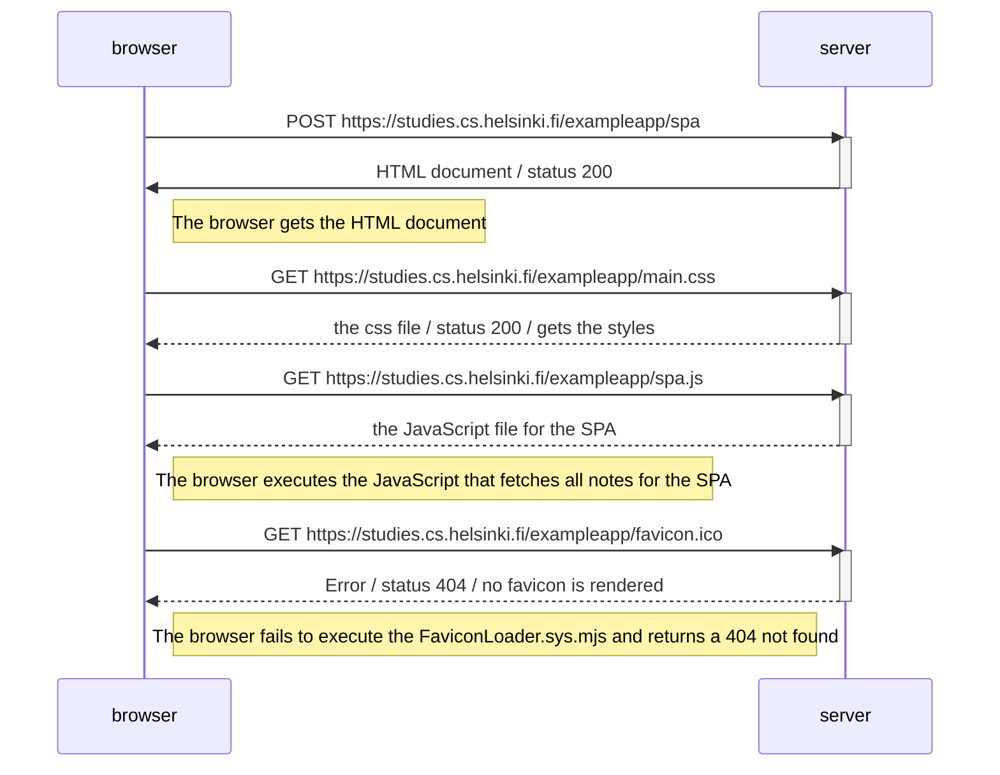

```mermaid
sequenceDiagram
  participant browser
  participant server

  browser->>server: POST https://studies.cs.helsinki.fi/exampleapp/spa
  activate server
  server->>browser: HTML document / status 200
  deactivate server

  Note right of browser: The browser gets the HTML document

  browser->>server: GET https://studies.cs.helsinki.fi/exampleapp/main.css
  activate server
  server-->>browser: the css file / status 200 / gets the styles
  deactivate server

  browser->>server: GET https://studies.cs.helsinki.fi/exampleapp/spa.js
  activate server
  server-->>browser: the JavaScript file for the SPA
  deactivate server

  Note right of browser: The browser executes the JavaScript that fetches all notes for the SPA

  browser->>server: GET https://studies.cs.helsinki.fi/exampleapp/favicon.ico
  activate server
  server-->>browser: Error / status 404 / no favicon is rendered
  deactivate server

  Note right of browser: The browser fails to execute the FaviconLoader.sys.mjs and returns a 404 not found

```
